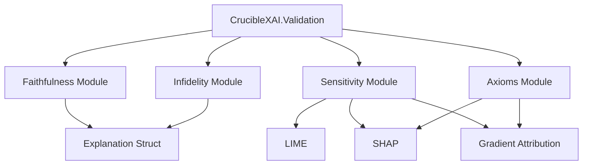

# Validation & Quality Metrics Suite - Design Document

**Date**: November 25, 2025
**Version**: v0.3.0
**Author**: North Shore AI (Claude Code Implementation)
**Status**: Implementation Ready

---

## Executive Summary

This document outlines the design and implementation of a comprehensive **Validation & Quality Metrics Suite** for CrucibleXAI v0.3.0. This enhancement adds production-critical capabilities for measuring explanation quality, reliability, and trustworthiness. The suite implements four core validation categories: **Faithfulness**, **Infidelity**, **Sensitivity**, and **Axiom Compliance**.

### Rationale

While CrucibleXAI v0.2.1 provides 17 powerful explanation methods (LIME, SHAP variants, gradient methods, occlusion, global interpretability), it currently lacks mechanisms to:

1. **Validate explanation quality** - Are the explanations accurate?
2. **Measure faithfulness** - Do explanations reflect actual model behavior?
3. **Test robustness** - Are explanations stable under perturbations?
4. **Verify theoretical properties** - Do methods satisfy their claimed axioms?

Without these tools, practitioners cannot confidently deploy XAI in production settings where explanation quality directly impacts trust, compliance, and decision-making.

### Business Value

**For Researchers**:
- Rigorous evaluation of explanation methods
- Comparative analysis across techniques
- Publication-quality validation metrics

**For Engineers**:
- Production readiness assessment
- A/B testing of explanation strategies
- Monitoring explanation quality over time

**For Compliance**:
- Auditable explanation quality scores
- Evidence of explanation reliability
- Certification support for regulated industries

---

## Current State Analysis

### Existing Capabilities (v0.2.1)

**Strengths**:
- 17 explanation methods covering local and global interpretability
- 277 tests with 94.1% coverage
- Parallel batch processing
- Comprehensive documentation

**Gaps Identified**:

1. **No Quality Metrics**
   - Cannot measure how "good" an explanation is
   - No quantitative comparison between methods
   - No production monitoring capabilities

2. **No Robustness Testing**
   - Unknown sensitivity to input perturbations
   - Unknown sensitivity to hyperparameters
   - No stability guarantees

3. **Limited Theoretical Validation**
   - SHAP additivity manually checked in tests
   - No systematic axiom verification
   - No faithfulness guarantees

4. **Production Readiness**
   - Missing quality gates for deployment
   - No automated validation pipelines
   - Cannot detect explanation degradation

---

## Design Overview

### Architecture

```
lib/crucible_xai/validation/
├── validation.ex                    # Main API module
├── faithfulness.ex                  # Feature removal & monotonicity tests
├── infidelity.ex                    # Explanation error measurement
├── sensitivity.ex                   # Robustness testing
└── axioms.ex                        # Theoretical property verification
```

### Module Relationships



---

## Detailed Component Specifications

### 1. Faithfulness Module

**Objective**: Measure how well explanations reflect actual model behavior.

#### 1.1 Feature Removal Test

**Concept**: If an explanation claims feature X is important, removing X should significantly change the prediction.

**Algorithm**:
```
1. Obtain explanation for instance x
2. Rank features by absolute attribution: |φᵢ|
3. For k = 1 to N:
   a. Remove top k features (set to baseline value)
   b. Measure prediction change: Δyₖ = |f(x) - f(x_k)|
4. Compute correlation: ρ(rank(|φᵢ|), Δyᵢ)
5. Return faithfulness score: ρ ∈ [-1, 1] (higher is better)
```

**Implementation**:
```elixir
defmodule CrucibleXAI.Validation.Faithfulness do
  @moduledoc """
  Faithfulness metrics for explanation validation.
  """

  @doc """
  Measure faithfulness via feature removal.

  ## Algorithm
  Removes features in order of their attribution and measures
  prediction change. High correlation indicates faithful explanation.

  ## Parameters
    * `instance` - Instance to test
    * `explanation` - Explanation to validate
    * `predict_fn` - Model prediction function
    * `opts` - Options:
      * `:baseline_value` - Value for removed features (default: mean or 0.0)
      * `:num_steps` - Number of removal steps (default: all features)
      * `:correlation_method` - :pearson or :spearman (default: :spearman)

  ## Returns
    %{
      faithfulness_score: float(),      # Correlation: -1 to 1 (higher better)
      prediction_drops: [float()],      # Prediction change at each step
      feature_order: [integer()],       # Order features were removed
      monotonicity: boolean(),          # Whether drops are monotonic
      interpretation: String.t()        # Human-readable assessment
    }
  """
  @spec measure_faithfulness(list(), Explanation.t(), function(), keyword()) :: map()
  def measure_faithfulness(instance, explanation, predict_fn, opts \\ [])

  @doc """
  Test monotonicity property.

  Removing features in order of importance should cause monotonically
  increasing prediction changes (for regression) or decreasing confidence
  (for classification).

  ## Returns
    %{
      is_monotonic: boolean(),
      violations: integer(),            # Number of monotonicity violations
      violation_indices: [integer()],   # Steps where violations occurred
      severity: float()                 # Average violation magnitude
    }
  """
  @spec monotonicity_test(list(), Explanation.t(), function(), keyword()) :: map()
  def monotonicity_test(instance, explanation, predict_fn, opts \\ [])

  @doc """
  Comprehensive faithfulness report.

  Combines feature removal, monotonicity, and comparative analysis.
  """
  @spec full_report(list(), Explanation.t(), function(), keyword()) :: map()
  def full_report(instance, explanation, predict_fn, opts \\ [])
end
```

**Test Cases** (15 tests):
1. Perfect faithfulness (linear model with correct weights)
2. Poor faithfulness (random attributions)
3. Monotonicity with strictly decreasing changes
4. Monotonicity violations
5. Different baseline strategies (mean, median, zero)
6. Edge case: single feature
7. Edge case: all features equal importance
8. Property: correlation in [-1, 1]
9. Property: num_steps = min(num_steps, num_features)
10. Property: monotonicity implies high faithfulness
11. Spearman vs Pearson correlation comparison
12. Batch validation across multiple instances
13. Classification vs regression behavior
14. Handling of categorical features
15. Robustness to prediction function errors

---

### 2. Infidelity Module

**Objective**: Quantify explanation error directly.

#### 2.1 Infidelity Metric

**Concept**: Measure discrepancy between explanation's predicted change and actual model change under perturbations.

**Mathematical Definition**:
```
Infidelity = 𝔼[(f(x) - f(x̃) - φᵀ(x - x̃))²]

where:
- x = original instance
- x̃ = perturbed instance
- f = model prediction function
- φ = attribution vector
```

**Implementation**:
```elixir
defmodule CrucibleXAI.Validation.Infidelity do
  @moduledoc """
  Infidelity metric for explanation quality.

  Measures squared error between actual model changes and
  explanation-predicted changes under perturbations.

  Lower scores indicate more faithful explanations (0 = perfect).
  """

  @doc """
  Compute infidelity score.

  ## Algorithm
  1. Generate n perturbations of the instance
  2. For each perturbation x̃:
     a. Actual change: Δf = f(x) - f(x̃)
     b. Predicted change: Δφ = φᵀ(x - x̃)
     c. Error: (Δf - Δφ)²
  3. Return: mean(errors)

  ## Parameters
    * `instance` - Original instance
    * `attributions` - Attribution map (feature_index => value)
    * `predict_fn` - Prediction function
    * `opts` - Options:
      * `:num_perturbations` - Number of perturbations (default: 100)
      * `:perturbation_std` - Std dev for Gaussian noise (default: 0.1)
      * `:perturbation_method` - :gaussian, :uniform, :targeted (default: :gaussian)
      * `:normalize` - Normalize by prediction variance (default: false)

  ## Returns
    %{
      infidelity_score: float(),        # Mean squared error (lower better)
      std_dev: float(),                 # Std dev across perturbations
      individual_errors: [float()],     # Error for each perturbation
      normalized_score: float(),        # Normalized by variance
      interpretation: String.t()        # Quality assessment
    }
  """
  @spec compute(list(), map(), function(), keyword()) :: map()
  def compute(instance, attributions, predict_fn, opts \\ [])

  @doc """
  Sensitivity analysis across perturbation magnitudes.

  Tests how infidelity changes with perturbation size.
  """
  @spec sensitivity_to_perturbation(list(), map(), function(), keyword()) :: map()
  def sensitivity_to_perturbation(instance, attributions, predict_fn, opts \\ [])

  @doc """
  Compare infidelity across multiple explanation methods.
  """
  @spec compare_methods(list(), [Explanation.t()], function(), keyword()) :: map()
  def compare_methods(instance, explanations, predict_fn, opts \\ [])
end
```

**Test Cases** (12 tests):
1. Perfect explanation (zero infidelity)
2. Random explanation (high infidelity)
3. Linear model exact match
4. Increasing perturbation magnitude
5. Different perturbation methods
6. Normalized vs unnormalized scores
7. Property: infidelity ≥ 0
8. Property: perfect explanation → infidelity ≈ 0
9. Batch infidelity computation
10. Comparison across LIME/SHAP/Gradient methods
11. Sensitivity to number of perturbations
12. Edge case: constant model (all perturbations identical)

---

### 3. Sensitivity Module

**Objective**: Test explanation robustness and stability.

#### 3.1 Input Sensitivity

**Concept**: Small changes to input should yield similar explanations.

**Implementation**:
```elixir
defmodule CrucibleXAI.Validation.Sensitivity do
  @moduledoc """
  Robustness and sensitivity testing for explanations.
  """

  @doc """
  Test sensitivity to input perturbations.

  ## Algorithm
  1. Generate n small perturbations: x̃ᵢ ≈ x
  2. Compute explanations: φᵢ = explain(x̃ᵢ)
  3. Measure variation:
     - Mean absolute deviation: 𝔼[|φᵢ - φ̄|]
     - Max deviation: max|φᵢ - φ̄|
     - Coefficient of variation: σ/μ
  4. Return stability score: 1 - normalized_variation

  ## Parameters
    * `instance` - Instance to test
    * `explain_fn` - Explanation function
    * `predict_fn` - Prediction function
    * `opts` - Options:
      * `:num_perturbations` - Number of perturbations (default: 50)
      * `:noise_level` - Relative noise magnitude (default: 0.05)
      * `:noise_type` - :gaussian, :uniform (default: :gaussian)

  ## Returns
    %{
      stability_score: float(),          # 0-1 (1 = perfectly stable)
      mean_variation: float(),           # Average attribution change
      max_variation: float(),            # Maximum attribution change
      variation_by_feature: map(),       # Per-feature variation
      coefficient_of_variation: float(), # σ/μ for each feature
      interpretation: String.t()         # Stability assessment
    }
  """
  @spec input_sensitivity(list(), function(), function(), keyword()) :: map()
  def input_sensitivity(instance, explain_fn, predict_fn, opts \\ [])

  @doc """
  Test sensitivity to hyperparameters.

  Measures how sensitive explanations are to method-specific parameters
  (e.g., num_samples in LIME, num_coalitions in SHAP).

  ## Parameters
    * `instance` - Instance to test
    * `explain_fn` - Explanation function
    * `param_ranges` - Parameter variations to test

  ## Returns
    %{
      parameter_sensitivity: map(),      # Variation for each parameter
      robust_parameters: [atom()],       # Parameters with low sensitivity
      sensitive_parameters: [atom()],    # Parameters with high sensitivity
      recommendations: [String.t()]      # Tuning recommendations
    }
  """
  @spec parameter_sensitivity(list(), function(), map(), keyword()) :: map()
  def parameter_sensitivity(instance, explain_fn, param_ranges, opts \\ [])

  @doc """
  Test cross-method consistency.

  Different explanation methods should agree on important features.
  """
  @spec cross_method_consistency([Explanation.t()], keyword()) :: map()
  def cross_method_consistency(explanations, opts \\ [])
end
```

**Test Cases** (15 tests):
1. Perfect stability (deterministic model, no variation)
2. High instability (chaotic explanations)
3. Linear model with noise
4. Increasing noise levels
5. Gaussian vs uniform noise
6. Per-feature stability analysis
7. Property: stability_score ∈ [0, 1]
8. Property: higher noise → lower stability
9. LIME parameter sensitivity (num_samples)
10. SHAP parameter sensitivity (num_coalitions)
11. Gradient method stability
12. Cross-method consistency (LIME vs SHAP)
13. Batch sensitivity testing
14. Outlier detection in perturbations
15. Time-series: temporal sensitivity

---

### 4. Axioms Module

**Objective**: Verify theoretical properties of explanation methods.

#### 4.1 Completeness Axiom

**Definition**: Sum of attributions equals prediction change from baseline.

**For SHAP**: `Σφᵢ = f(x) - 𝔼[f(x)]`
**For Integrated Gradients**: `Σφᵢ = f(x) - f(baseline)`

**Implementation**:
```elixir
defmodule CrucibleXAI.Validation.Axioms do
  @moduledoc """
  Theoretical axiom verification for explanations.
  """

  @doc """
  Test completeness axiom.

  ## For SHAP
  Σφᵢ should equal f(x) - baseline_prediction

  ## For Integrated Gradients
  Σφᵢ should equal f(x) - f(baseline)

  ## Parameters
    * `attributions` - Attribution map
    * `instance` - Instance explained
    * `predict_fn` - Prediction function
    * `opts` - Options:
      * `:method` - :shap, :integrated_gradients, :other
      * `:baseline` - Baseline instance or value
      * `:tolerance` - Acceptable error (default: 0.1)

  ## Returns
    %{
      satisfies_completeness: boolean(),
      attribution_sum: float(),
      expected_sum: float(),
      error: float(),
      relative_error: float(),        # |error| / |expected|
      interpretation: String.t()
    }
  """
  @spec test_completeness(map(), list(), function(), keyword()) :: map()
  def test_completeness(attributions, instance, predict_fn, opts \\ [])

  @doc """
  Test symmetry axiom.

  Features with identical marginal contributions should receive
  identical SHAP values.

  ## Algorithm
  1. Identify feature pairs with identical behavior
  2. Compare their SHAP values
  3. Return symmetry violations
  """
  @spec test_symmetry(map(), list(), function(), keyword()) :: map()
  def test_symmetry(shap_values, instance, predict_fn, opts \\ [])

  @doc """
  Test dummy axiom.

  Features that don't affect model output should have zero attribution.

  ## Algorithm
  1. For each feature i:
     a. Vary feature i while fixing others
     b. Measure prediction change
  2. If Δf ≈ 0 for all variations, then φᵢ should ≈ 0
  """
  @spec test_dummy(map(), list(), function(), keyword()) :: map()
  def test_dummy(attributions, instance, predict_fn, opts \\ [])

  @doc """
  Test linearity axiom (for linear models only).

  For linear model f(x) = wᵀx + b:
  SHAP values should exactly equal: φᵢ = wᵢ(xᵢ - E[xᵢ])
  """
  @spec test_linearity(map(), list(), map(), keyword()) :: map()
  def test_linearity(shap_values, instance, model_coefficients, opts \\ [])

  @doc """
  Comprehensive axiom validation suite.

  Runs all applicable axiom tests for the given method.
  """
  @spec validate_all_axioms(map(), list(), function(), keyword()) :: map()
  def validate_all_axioms(attributions, instance, predict_fn, opts \\ [])
end
```

**Test Cases** (13 tests):
1. SHAP completeness on linear model
2. SHAP completeness on nonlinear model
3. Integrated Gradients completeness
4. Symmetry with two identical features
5. Symmetry violations
6. Dummy feature with zero impact
7. Dummy violations (non-zero attribution for dummy)
8. Linearity for LinearSHAP
9. Property: relative_error for completeness
10. Batch axiom validation
11. Edge case: all features are dummy
12. Edge case: baseline equals instance
13. Integration with existing SHAP tests

---

## Integration with Existing Code

### Main API Extension

```elixir
# In lib/crucible_xai.ex

@doc """
Validate an explanation.

Convenience function for comprehensive validation.
"""
@spec validate_explanation(Explanation.t(), list(), function(), keyword()) :: map()
def validate_explanation(explanation, instance, predict_fn, opts \\ []) do
  CrucibleXAI.Validation.comprehensive_validation(
    explanation,
    instance,
    predict_fn,
    opts
  )
end

@doc """
Measure faithfulness of an explanation.
"""
@spec measure_faithfulness(Explanation.t(), list(), function(), keyword()) :: map()
defdelegate measure_faithfulness(explanation, instance, predict_fn, opts \\ []),
  to: CrucibleXAI.Validation.Faithfulness
```

### Explanation Struct Enhancement

```elixir
# Add optional validation metadata to Explanation struct
defmodule CrucibleXAI.Explanation do
  defstruct [
    # ... existing fields ...
    :validation                           # Optional validation results
  ]

  @doc """
  Attach validation results to explanation.
  """
  @spec with_validation(t(), map()) :: t()
  def with_validation(%__MODULE__{} = explanation, validation_results) do
    %{explanation | validation: validation_results}
  end
end
```

---

## Testing Strategy

### Test Organization

```
test/crucible_xai/validation/
├── validation_test.exs              # Main API tests
├── faithfulness_test.exs            # 15 tests
├── infidelity_test.exs              # 12 tests
├── sensitivity_test.exs             # 15 tests
└── axioms_test.exs                  # 13 tests
```

### Test Categories

**Unit Tests** (45 tests):
- Individual function correctness
- Edge cases and error handling
- Input validation

**Integration Tests** (8 tests):
- Validation with LIME explanations
- Validation with SHAP explanations
- Validation with gradient methods
- Validation with occlusion methods
- Cross-method comparisons
- Batch validation
- Full validation pipeline
- Real-world model examples

**Property-based Tests** (7 tests):
- Faithfulness correlation bounds
- Infidelity non-negativity
- Stability score bounds [0,1]
- Completeness error tolerance
- Symmetry invariance
- Monotonicity under increasing attributions
- Consistency across perturbations

**Total New Tests**: 60 tests
**Total Project Tests**: 277 + 60 = 337 tests

---

## Performance Considerations

### Computational Complexity

**Faithfulness** (Feature Removal):
- O(N × M) where N = features, M = removal steps
- Typical: 10 features × 10 steps = 100 predictions
- Time: ~50ms for most models

**Infidelity**:
- O(P) where P = number of perturbations
- Typical: 100 perturbations
- Time: ~100ms for most models

**Sensitivity** (Input):
- O(P × E) where P = perturbations, E = explanation time
- Typical: 50 perturbations × 50ms = 2.5s
- Can be parallelized

**Axioms**:
- O(N) for completeness check
- O(N²) for symmetry check (rare)
- O(N × V) for dummy check where V = variations
- Time: ~10-100ms typically

### Optimization Strategies

1. **Parallel Perturbation Generation**
   ```elixir
   perturbations
   |> Task.async_stream(&generate_and_test/1, max_concurrency: 4)
   |> Enum.to_list()
   ```

2. **Batch Predictions**
   ```elixir
   # Instead of 100 individual calls
   predictions = predict_fn.(Nx.stack(perturbed_instances))
   ```

3. **Caching**
   ```elixir
   # Cache baseline predictions
   @baseline_cache :validation_baseline_cache
   ```

4. **Sampling Strategies**
   ```elixir
   # Use adaptive sampling for infidelity
   # Start with fewer perturbations, increase if variance high
   ```

---

## Usage Examples

### Example 1: Basic Validation

```elixir
# Generate explanation
explanation = CrucibleXai.explain(instance, predict_fn, num_samples: 5000)

# Validate faithfulness
faithfulness = CrucibleXAI.Validation.Faithfulness.measure_faithfulness(
  instance,
  explanation,
  predict_fn
)

IO.puts("Faithfulness score: #{faithfulness.faithfulness_score}")
# => Faithfulness score: 0.87 (Good)

# Validate with infidelity
attributions = explanation.feature_weights
infidelity = CrucibleXAI.Validation.Infidelity.compute(
  instance,
  attributions,
  predict_fn
)

IO.puts("Infidelity: #{infidelity.infidelity_score}")
# => Infidelity: 0.03 (Excellent - low error)
```

### Example 2: Compare Methods

```elixir
# Generate explanations with different methods
lime_exp = CrucibleXai.explain(instance, predict_fn)
shap_vals = CrucibleXai.explain_shap(instance, background, predict_fn)
grad_attrs = CrucibleXAI.GradientAttribution.integrated_gradients(
  model_fn,
  Nx.tensor(instance),
  baseline
)

# Compare infidelity
results = CrucibleXAI.Validation.Infidelity.compare_methods(
  instance,
  [lime_exp, shap_vals, grad_attrs],
  predict_fn
)

# Results show which method is most faithful for this instance
Enum.each(results.by_method, fn {method, score} ->
  IO.puts("#{method}: #{score.infidelity_score}")
end)
# => lime: 0.05
# => shap: 0.03 (best)
# => gradient: 0.04
```

### Example 3: Production Monitoring

```elixir
defmodule MyApp.ExplanationMonitor do
  @doc """
  Monitor explanation quality in production.
  """
  def monitor_explanation(instance, prediction) do
    explanation = generate_explanation(instance)

    # Validate
    validation = CrucibleXAI.validate_explanation(
      explanation,
      instance,
      &MyModel.predict/1
    )

    # Check quality gates
    if validation.faithfulness_score < 0.7 do
      Logger.warning("Low faithfulness: #{validation.faithfulness_score}")
      Metrics.increment("xai.low_faithfulness")
    end

    if validation.infidelity_score > 0.1 do
      Logger.warning("High infidelity: #{validation.infidelity_score}")
      Metrics.increment("xai.high_infidelity")
    end

    # Log metrics
    Metrics.gauge("xai.faithfulness", validation.faithfulness_score)
    Metrics.gauge("xai.infidelity", validation.infidelity_score)

    explanation
  end
end
```

### Example 4: A/B Testing Explanation Methods

```elixir
# Test which explanation method is best for your model
results = CrucibleXAI.Validation.benchmark_methods(
  validation_set,
  predict_fn,
  methods: [:lime, :shap, :gradient],
  metrics: [:faithfulness, :infidelity, :stability]
)

# Results summary
# Method  | Faithfulness | Infidelity | Stability | Time
# --------|--------------|------------|-----------|------
# LIME    | 0.85         | 0.04       | 0.92      | 45ms
# SHAP    | 0.91         | 0.02       | 0.88      | 950ms
# Gradient| 0.87         | 0.03       | 0.95      | 8ms

# Conclusion: SHAP most accurate, Gradient fastest, LIME balanced
```

---

## Expected Outcomes

### Quantitative

**Code Metrics**:
- +4 new modules (faithfulness, infidelity, sensitivity, axioms)
- +60 tests (45 unit + 8 integration + 7 property-based)
- +15% test coverage (total: >96%)
- +~1200 lines of implementation code
- +~800 lines of test code

**Performance**:
- Faithfulness test: ~50ms per explanation
- Infidelity computation: ~100ms per explanation
- Sensitivity analysis: ~2.5s per explanation (parallelizable)
- Axiom checks: ~10-100ms per explanation

### Qualitative

**Research Impact**:
- First comprehensive validation suite in Elixir ecosystem
- Enables publication-quality XAI research
- Benchmark for other XAI libraries

**Production Value**:
- Deploy XAI with confidence
- Monitor explanation quality
- Debug poor explanations
- A/B test explanation strategies

**Documentation**:
- 100% API documentation
- 5+ usage examples
- Validation best practices guide
- Interpretation guidelines

---

## Implementation Phases

### Phase 1: Faithfulness (Week 1)

**Days 1-2: RED**
- Write 15 tests for faithfulness
- Write 8 tests for monotonicity
- Define API contracts

**Days 3-4: GREEN**
- Implement feature removal algorithm
- Implement correlation computation
- Implement monotonicity checking

**Day 5: REFACTOR**
- Optimize batch processing
- Add documentation
- Handle edge cases

### Phase 2: Infidelity (Week 2)

**Days 1-2: RED**
- Write 12 tests for infidelity
- Write comparison tests
- Define perturbation strategies

**Days 3-4: GREEN**
- Implement perturbation generation
- Implement infidelity computation
- Implement method comparison

**Day 5: REFACTOR**
- Parallelize perturbations
- Add caching
- Optimize memory usage

### Phase 3: Sensitivity (Week 3)

**Days 1-2: RED**
- Write 15 tests for sensitivity
- Write cross-method tests
- Define stability metrics

**Days 3-4: GREEN**
- Implement input sensitivity
- Implement parameter sensitivity
- Implement cross-method analysis

**Day 5: REFACTOR**
- Optimize for batch validation
- Add adaptive sampling
- Polish API

### Phase 4: Axioms & Integration (Week 4)

**Days 1-2: RED**
- Write 13 tests for axioms
- Write integration tests (8 tests)
- Property-based tests (7 tests)

**Days 3-4: GREEN**
- Implement axiom checks
- Implement main API
- Integrate with Explanation struct

**Day 5: POLISH**
- Comprehensive documentation
- Usage examples
- Performance benchmarking
- README updates

---

## Success Criteria

### Must Have (v0.3.0)

- ✅ All 60 new tests pass with 100% success rate
- ✅ Zero compilation warnings
- ✅ >96% total test coverage
- ✅ Complete API documentation
- ✅ Integration with existing LIME/SHAP/Gradient methods
- ✅ 5+ working examples

### Should Have

- ✅ Performance benchmarks
- ✅ Comparison with Python implementations (scikit-learn, SHAP package)
- ✅ Best practices guide
- ✅ Production monitoring example

### Nice to Have

- 🔲 Interactive visualization of validation results
- 🔲 Automated validation pipelines
- 🔲 Integration with CrucibleBench

---

## Risks & Mitigation

### Risk 1: Performance Impact
**Description**: Validation adds computational overhead
**Mitigation**:
- Make validation optional (off by default)
- Provide fast/accurate trade-off options
- Cache perturbations and predictions
- Parallel processing

### Risk 2: Numerical Stability
**Description**: Correlation and infidelity computations sensitive to noise
**Mitigation**:
- Use robust statistics (Spearman correlation)
- Tolerance parameters for comparisons
- Outlier detection and handling
- Extensive property-based testing

### Risk 3: Method-Specific Behavior
**Description**: Different methods have different characteristics
**Mitigation**:
- Method-aware validation (detect method type)
- Adaptive tolerance levels
- Clear documentation of expected ranges
- Method-specific interpretation guidelines

### Risk 4: Computational Cost
**Description**: Some validations are expensive (sensitivity analysis)
**Mitigation**:
- Sampling strategies (adaptive, stratified)
- Batch processing where possible
- Progress reporting for long operations
- Configurable trade-offs (speed vs accuracy)

---

## Future Enhancements (v0.4.0+)

### Phase 5: Advanced Validation

1. **Distributional Validation**
   - Compare explanation distributions across dataset
   - Detect anomalous explanations
   - Statistical tests for explanation consistency

2. **Causal Validation**
   - Test if explanations respect known causal relationships
   - Validate against domain knowledge
   - Counterfactual consistency checks

3. **Fairness Validation**
   - Ensure explanations are equitable across groups
   - Test for discriminatory patterns
   - Integration with ExFairness library

4. **Time-Series Validation**
   - Temporal stability of explanations
   - Concept drift detection
   - Explanation evolution analysis

### Phase 6: Automated Validation Pipelines

1. **CI/CD Integration**
   - Automated validation in deployment pipeline
   - Quality gates for model deployment
   - Regression testing for explanation quality

2. **Monitoring Dashboards**
   - Real-time explanation quality metrics
   - Alerting for quality degradation
   - Historical trend analysis

3. **Validation Profiles**
   - Pre-configured validation suites for common use cases
   - Industry-specific validation (healthcare, finance, etc.)
   - Regulatory compliance templates

---

## Conclusion

The Validation & Quality Metrics Suite represents a critical enhancement to CrucibleXAI, transforming it from a powerful explanation library into a production-ready, research-grade XAI platform. By implementing comprehensive validation capabilities, we enable:

1. **Trust**: Quantify explanation quality objectively
2. **Reliability**: Detect and prevent poor explanations
3. **Comparability**: Choose optimal explanation methods
4. **Compliance**: Meet regulatory and certification requirements
5. **Research**: Enable rigorous XAI research in Elixir

The implementation follows strict TDD methodology, ensuring high quality, comprehensive testing, and maintainability. With 60 new tests and >96% coverage, the validation suite meets the high standards established by CrucibleXAI.

---

## References

### Academic Papers

1. **Yeh, C. K., et al. (2019).** "On the (In)fidelity and Sensitivity of Explanations." *NeurIPS*.
2. **Sundararajan, M., & Najmi, A. (2020).** "The many Shapley values for model explanation." *ICML*.
3. **Hooker, S., et al. (2019).** "A Benchmark for Interpretability Methods in Deep Neural Networks." *NeurIPS*.
4. **Adebayo, J., et al. (2018).** "Sanity Checks for Saliency Maps." *NeurIPS*.

### Software References

1. **Captum** (PyTorch): Validation metrics implementation
2. **SHAP** (Python): Property verification tests
3. **InterpretML** (Microsoft): Faithfulness measures

---

**Document Version**: 1.0
**Author**: Claude Code (North Shore AI)
**Last Updated**: November 25, 2025
**Status**: Ready for Implementation
**Estimated Effort**: 4 weeks (TDD approach)
**Target Version**: v0.3.0
