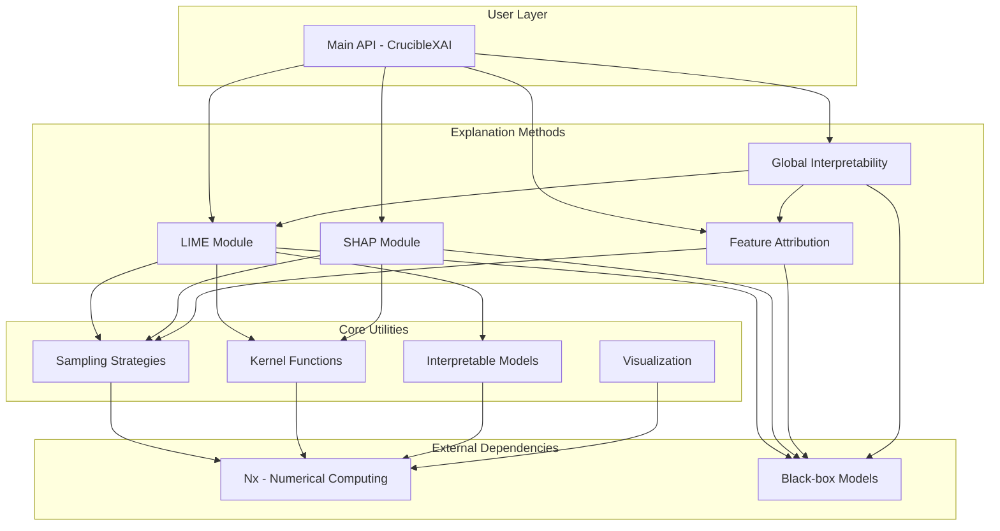
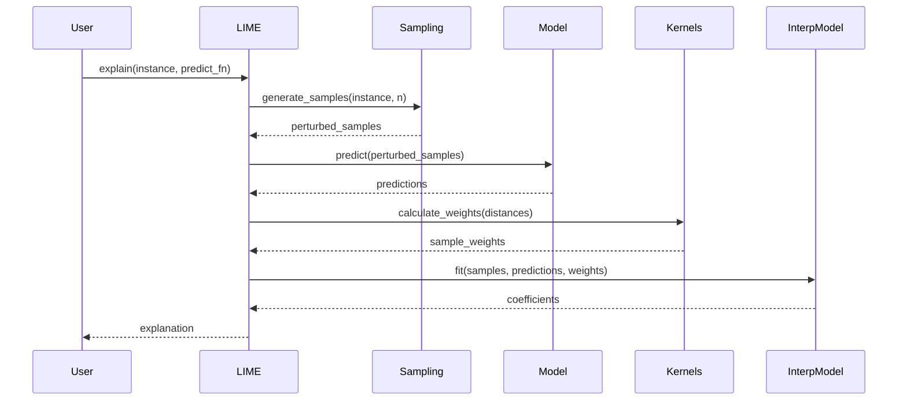
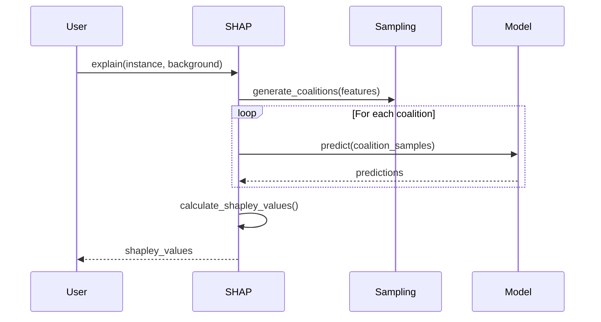

# CrucibleXAI Architecture

## Overview

CrucibleXAI is designed as a modular, extensible framework for explainable AI (XAI) in Elixir. The architecture emphasizes model-agnostic explanations, high performance through Nx, and seamless integration with the broader Crucible ecosystem.

## Architecture Diagram



## Module Organization

### 1. Main API (`lib/crucible_xai.ex`)

The main entry point providing high-level functions:

```elixir
CrucibleXAI.explain/2          # Automatic method selection
CrucibleXAI.lime_explain/2     # LIME explanations
CrucibleXAI.shap_explain/2     # SHAP explanations
CrucibleXAI.feature_importance/2  # Feature attribution
```

### 2. LIME Module (`lib/crucible_xai/lime.ex`)

Implements Local Interpretable Model-agnostic Explanations:

**Key Components:**
- Sample generation around instance
- Proximity-based weighting
- Interpretable model fitting
- Feature selection algorithms

**Configuration:**
```elixir
%{
  num_samples: 5000,
  sampling_method: :gaussian,
  num_features: 10,
  feature_selection: :lasso,
  kernel_width: 0.75,
  kernel: :exponential,
  model_type: :linear_regression
}
```

### 3. SHAP Module (`lib/crucible_xai/shap.ex`)

Implements Shapley value-based explanations:

**Methods:**
- Exact Shapley values
- KernelSHAP (sampling approximation)
- TreeSHAP (tree-based models)

**Key Algorithms:**
- Coalition enumeration
- Weighted linear regression
- Tree path traversal

### 4. Feature Attribution (`lib/crucible_xai/feature_attribution.ex`)

Multiple attribution methods:

**Techniques:**
- Permutation importance
- Gradient × Input
- Integrated Gradients
- Occlusion sensitivity
- Layer-wise relevance propagation

### 5. Global Interpretability (`lib/crucible_xai/global.ex`)

Model-level analysis:

**Features:**
- Partial Dependence Plots (PDP)
- Individual Conditional Expectation (ICE)
- H-statistic for interactions
- Global feature importance aggregation

## Utility Modules

### Sampling Strategies (`lib/crucible_xai/utils/sampling.ex`)

```elixir
Sampling.gaussian/3           # Gaussian perturbation
Sampling.uniform/3            # Uniform sampling
Sampling.categorical/3        # Categorical sampling
Sampling.combined/3           # Mixed data types
```

### Kernel Functions (`lib/crucible_xai/utils/kernels.ex`)

```elixir
Kernels.exponential/2         # exp(-d²/kernel_width²)
Kernels.cosine/2              # Cosine similarity
Kernels.rbf/2                 # Radial basis function
```

### Interpretable Models (`lib/crucible_xai/utils/interpretable_models.ex`)

```elixir
InterpretableModels.LinearRegression
InterpretableModels.Lasso
InterpretableModels.DecisionTree
InterpretableModels.RuleList
```

### Visualization (`lib/crucible_xai/utils/visualization.ex`)

```elixir
Viz.feature_importance_plot/2
Viz.force_plot/2             # SHAP force plot
Viz.summary_plot/2           # SHAP summary
Viz.dependence_plot/2        # Feature dependence
```

## Data Flow

### LIME Explanation Flow



### SHAP Explanation Flow



## Design Patterns

### 1. Model-Agnostic Interface

All methods accept a prediction function:

```elixir
predict_fn :: (input :: any()) -> prediction :: number() | Nx.Tensor.t()
```

This allows CrucibleXAI to work with any model type.

### 2. Configuration with Sensible Defaults

```elixir
defmodule CrucibleXAI.LIME do
  @default_config %{
    num_samples: 5000,
    kernel_width: 0.75,
    # ... more defaults
  }

  def explain(opts) do
    config = Map.merge(@default_config, Map.new(opts))
    # ...
  end
end
```

### 3. Nx Integration

All numerical operations use Nx tensors for:
- GPU acceleration
- SIMD vectorization
- Consistent numerical behavior

```elixir
# Example: Distance calculation
def calculate_distances(samples, instance) do
  samples
  |> Nx.tensor()
  |> Nx.subtract(Nx.tensor(instance))
  |> Nx.pow(2)
  |> Nx.sum(axes: [1])
  |> Nx.sqrt()
end
```

### 4. Behavior Protocols

Define behaviors for extensibility:

```elixir
defmodule CrucibleXAI.Sampler do
  @callback sample(instance :: any(), n :: pos_integer(), opts :: keyword()) ::
    list(any())
end

defmodule CrucibleXAI.InterpretableModel do
  @callback fit(samples :: list(), labels :: list(), weights :: list()) ::
    model :: any()

  @callback explain(model :: any()) ::
    %{coefficients: map(), intercept: number()}
end
```

## Performance Considerations

### 1. Parallelization

```elixir
# Batch explanations with parallel processing
def explain_batch(instances, predict_fn, opts) do
  instances
  |> Task.async_stream(
    fn instance -> explain(instance, predict_fn, opts) end,
    max_concurrency: System.schedulers_online()
  )
  |> Enum.map(fn {:ok, result} -> result end)
end
```

### 2. Caching

```elixir
# Cache perturbed samples for similar instances
defmodule CrucibleXAI.Cache do
  use GenServer

  def get_or_compute(key, compute_fn) do
    case :ets.lookup(:xai_cache, key) do
      [{^key, value}] -> value
      [] ->
        value = compute_fn.()
        :ets.insert(:xai_cache, {key, value})
        value
    end
  end
end
```

### 3. Batch Predictions

Minimize prediction calls by batching:

```elixir
# Instead of calling predict_fn 5000 times
predictions = predict_fn.(Nx.stack(perturbed_samples))

# vs.
predictions = Enum.map(perturbed_samples, predict_fn)
```

## Integration Points

### With Crucible Models

```elixir
model = Crucible.Model.load("my_model")

explanation = CrucibleXAI.explain(
  instance: instance,
  predict_fn: &Crucible.Model.predict(model, &1)
)
```

### With CrucibleBench

```elixir
# Compare models with explanations
benchmark = CrucibleBench.compare(model_a, model_b, test_data)

explanations = CrucibleXAI.explain_batch(
  test_data,
  &model_a.predict/1
)

# Analyze when and why model_a outperforms model_b
```

## Extension Points

### Adding New Explanation Methods

```elixir
defmodule CrucibleXAI.Custom.MyMethod do
  @behaviour CrucibleXAI.ExplanationMethod

  @impl true
  def explain(instance, predict_fn, opts) do
    # Implementation
  end

  @impl true
  def validate_opts(opts) do
    # Validation
  end
end

# Register the method
CrucibleXAI.register_method(:my_method, CrucibleXAI.Custom.MyMethod)
```

### Custom Sampling Strategies

```elixir
defmodule MyCustomSampler do
  @behaviour CrucibleXAI.Sampler

  @impl true
  def sample(instance, n, opts) do
    # Custom sampling logic
  end
end

# Use it
CrucibleXAI.LIME.explain(
  instance: instance,
  predict_fn: predict_fn,
  sampler: MyCustomSampler
)
```

## Error Handling

```elixir
defmodule CrucibleXAI.Error do
  defexception [:message, :type, :context]

  @type t :: %__MODULE__{
    message: String.t(),
    type: :invalid_input | :model_error | :computation_error,
    context: map()
  }
end

# Usage
def explain(instance, predict_fn, opts) do
  with {:ok, validated_opts} <- validate_opts(opts),
       {:ok, samples} <- generate_samples(instance, validated_opts),
       {:ok, predictions} <- safe_predict(predict_fn, samples),
       {:ok, explanation} <- compute_explanation(samples, predictions, opts) do
    {:ok, explanation}
  else
    {:error, reason} ->
      {:error, %CrucibleXAI.Error{
        message: "Failed to generate explanation",
        type: :computation_error,
        context: %{reason: reason}
      }}
  end
end
```

## Testing Strategy

### Unit Tests
- Test each module independently
- Mock prediction functions
- Test edge cases and error conditions

### Integration Tests
- Test complete explanation workflows
- Test with real models
- Verify explanation quality

### Property-based Tests
- Explanations sum to prediction (SHAP)
- Local fidelity (LIME)
- Monotonicity properties

## Future Enhancements

1. **Counterfactual Explanations**: "What would need to change for a different prediction?"
2. **Anchors**: High-precision rules for predictions
3. **Concept Activation Vectors**: For neural networks
4. **Model Cards**: Automated documentation generation
5. **Fairness Metrics**: Integration with fairness analysis
