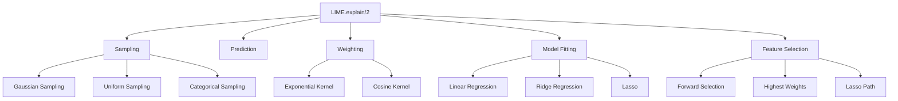

# LIME Implementation Design

## Overview

LIME (Local Interpretable Model-agnostic Explanations) is a technique for explaining the predictions of any machine learning classifier by approximating it locally with an interpretable model.

**Paper**: Ribeiro, M. T., Singh, S., & Guestrin, C. (2016). "Why Should I Trust You?": Explaining the Predictions of Any Classifier. KDD.

## Core Concepts

### The LIME Algorithm

LIME explains a prediction by:

1. **Perturbing** the input instance to create a dataset of similar instances
2. **Predicting** outcomes for these perturbed instances using the black-box model
3. **Weighting** instances by their proximity to the original instance
4. **Learning** an interpretable model on this weighted dataset
5. **Extracting** feature importances from the interpretable model

### Mathematical Formulation

Given:
- Instance to explain: `x`
- Black-box model: `f`
- Interpretable model class: `G` (e.g., linear models)
- Proximity measure: `π_x(z)`
- Complexity measure: `Ω(g)`

LIME solves:

```
explanation(x) = argmin_{g ∈ G} L(f, g, π_x) + Ω(g)
```

Where:
- `L` is the loss function measuring how well `g` approximates `f` in the locality of `x`
- `π_x(z)` measures how close `z` is to `x`
- `Ω(g)` penalizes complexity of the explanation

## Implementation Architecture

### Module Structure



## Detailed Design

### 1. Sampling Module

**Purpose**: Generate perturbed samples around the instance to explain.

#### For Continuous Features

```elixir
defmodule CrucibleXAI.LIME.Sampling do
  @doc """
  Generate perturbed samples using Gaussian perturbation.

  Each feature is perturbed independently by adding Gaussian noise
  scaled by the feature's standard deviation in the training data.
  """
  def gaussian(instance, n_samples, opts \\ []) do
    feature_stats = Keyword.get(opts, :feature_stats)
    scale = Keyword.get(opts, :scale, 1.0)

    instance
    |> Nx.tensor()
    |> Nx.new_axis(0)
    |> Nx.tile([n_samples, 1])
    |> add_gaussian_noise(feature_stats, scale)
  end

  defp add_gaussian_noise(tensor, feature_stats, scale) do
    noise = Nx.random_normal(Nx.shape(tensor))
    std_devs = Nx.tensor(feature_stats.std_devs)

    tensor
    |> Nx.add(Nx.multiply(noise, Nx.multiply(std_devs, scale)))
  end
end
```

#### For Categorical Features

```elixir
def categorical(instance, n_samples, opts \\ []) do
  categorical_indices = Keyword.get(opts, :categorical_features, [])
  feature_values = Keyword.get(opts, :feature_values, %{})

  # For each categorical feature, sample from observed values
  Enum.map(1..n_samples, fn _ ->
    Enum.map(Enum.with_index(instance), fn {value, idx} ->
      if idx in categorical_indices do
        Enum.random(feature_values[idx])
      else
        value
      end
    end)
  end)
end
```

#### Mixed Feature Types

```elixir
def combined(instance, n_samples, opts \\ []) do
  categorical_indices = Keyword.get(opts, :categorical_features, [])

  # Perturb continuous features with Gaussian noise
  continuous_perturbed = gaussian(instance, n_samples, opts)

  # Replace categorical features with random samples
  Enum.map(continuous_perturbed, fn sample ->
    Enum.map(Enum.with_index(sample), fn {value, idx} ->
      if idx in categorical_indices do
        random_categorical_value(instance, idx, opts)
      else
        value
      end
    end)
  end)
end
```

### 2. Kernel Functions

**Purpose**: Compute proximity weights for perturbed samples.

```elixir
defmodule CrucibleXAI.LIME.Kernels do
  @doc """
  Exponential kernel: exp(-d²/width²)

  Gives exponentially decreasing weight as distance increases.
  """
  def exponential(distances, kernel_width \\ 0.75) do
    distances
    |> Nx.pow(2)
    |> Nx.divide(kernel_width ** 2)
    |> Nx.negate()
    |> Nx.exp()
  end

  @doc """
  Cosine similarity kernel: (1 + cos(πd)) / 2

  Provides smooth transition from 1 to 0 as distance goes from 0 to 1.
  """
  def cosine(distances) do
    distances
    |> Nx.multiply(:math.pi())
    |> Nx.cos()
    |> Nx.add(1)
    |> Nx.divide(2)
  end

  @doc """
  Calculate Euclidean distances between samples and instance.
  """
  def euclidean_distance(samples, instance) do
    instance_tensor = Nx.tensor(instance)

    samples
    |> Nx.tensor()
    |> Nx.subtract(instance_tensor)
    |> Nx.pow(2)
    |> Nx.sum(axes: [1])
    |> Nx.sqrt()
  end
end
```

### 3. Interpretable Models

#### Linear Regression

```elixir
defmodule CrucibleXAI.LIME.InterpretableModels.LinearRegression do
  @moduledoc """
  Weighted linear regression for LIME.

  Solves: β = (X'WX)^(-1) X'Wy
  where W is a diagonal matrix of sample weights.
  """

  def fit(samples, labels, weights) do
    x = Nx.tensor(samples)
    y = Nx.tensor(labels)
    w = Nx.tensor(weights)

    # Add intercept column
    x_with_intercept = add_intercept(x)

    # Weighted least squares
    w_sqrt = Nx.sqrt(w) |> Nx.reshape({:auto, 1})
    x_weighted = Nx.multiply(x_with_intercept, w_sqrt)
    y_weighted = Nx.multiply(y, Nx.flatten(w_sqrt))

    # β = (X'X)^(-1) X'y
    xtx = Nx.dot(Nx.transpose(x_weighted), x_weighted)
    xty = Nx.dot(Nx.transpose(x_weighted), y_weighted)

    coefficients = solve_linear_system(xtx, xty)

    %{
      intercept: Nx.to_number(coefficients[0]),
      coefficients: coefficients[1..-1//1] |> Nx.to_flat_list(),
      r_squared: calculate_r_squared(x_with_intercept, y, coefficients)
    }
  end

  defp add_intercept(x) do
    ones = Nx.broadcast(1.0, {Nx.axis_size(x, 0), 1})
    Nx.concatenate([ones, x], axis: 1)
  end

  defp solve_linear_system(a, b) do
    # Use LU decomposition or pseudo-inverse
    Nx.LinAlg.solve(a, b)
  end

  defp calculate_r_squared(x, y, coefficients) do
    predictions = Nx.dot(x, coefficients)
    residuals = Nx.subtract(y, predictions)
    ss_res = residuals |> Nx.pow(2) |> Nx.sum()

    y_mean = Nx.mean(y)
    ss_tot = y |> Nx.subtract(y_mean) |> Nx.pow(2) |> Nx.sum()

    Nx.subtract(1.0, Nx.divide(ss_res, ss_tot))
    |> Nx.to_number()
  end
end
```

#### Ridge Regression (L2 Regularization)

```elixir
defmodule CrucibleXAI.LIME.InterpretableModels.Ridge do
  @doc """
  Ridge regression with L2 regularization.

  Solves: β = (X'WX + λI)^(-1) X'Wy
  """
  def fit(samples, labels, weights, lambda \\ 1.0) do
    x = Nx.tensor(samples)
    y = Nx.tensor(labels)
    w = Nx.tensor(weights)

    x_with_intercept = add_intercept(x)

    w_sqrt = Nx.sqrt(w) |> Nx.reshape({:auto, 1})
    x_weighted = Nx.multiply(x_with_intercept, w_sqrt)
    y_weighted = Nx.multiply(y, Nx.flatten(w_sqrt))

    xtx = Nx.dot(Nx.transpose(x_weighted), x_weighted)
    xty = Nx.dot(Nx.transpose(x_weighted), y_weighted)

    # Add L2 penalty (don't regularize intercept)
    n_features = Nx.axis_size(xtx, 0)
    penalty = Nx.eye(n_features) |> Nx.multiply(lambda)
    penalty = Nx.put_slice(penalty, [0, 0], Nx.tensor([[0.0]]))

    xtx_regularized = Nx.add(xtx, penalty)
    coefficients = Nx.LinAlg.solve(xtx_regularized, xty)

    %{
      intercept: Nx.to_number(coefficients[0]),
      coefficients: coefficients[1..-1//1] |> Nx.to_flat_list(),
      lambda: lambda
    }
  end
end
```

### 4. Feature Selection

**Purpose**: Select the most important features for the explanation.

#### Lasso-based Selection

```elixir
defmodule CrucibleXAI.LIME.FeatureSelection do
  @doc """
  Select features using Lasso (L1 regularization).

  L1 regularization drives some coefficients to exactly zero,
  effectively performing feature selection.
  """
  def lasso(samples, labels, weights, n_features) do
    # Use coordinate descent for Lasso
    lambdas = generate_lambda_path(samples, labels, weights)

    # Find lambda that gives desired number of features
    Enum.find_value(lambdas, fn lambda ->
      model = fit_lasso(samples, labels, weights, lambda)
      non_zero_features = count_non_zero(model.coefficients)

      if non_zero_features <= n_features do
        get_top_features(model.coefficients, n_features)
      end
    end)
  end

  @doc """
  Forward selection: iteratively add features that improve fit most.
  """
  def forward_selection(samples, labels, weights, n_features) do
    n_total_features = length(hd(samples))
    selected = []
    remaining = Enum.to_list(0..(n_total_features - 1))

    Enum.reduce(1..n_features, selected, fn _, acc ->
      # Try adding each remaining feature
      candidates = Enum.map(remaining -- acc, fn feature ->
        features = acc ++ [feature]
        samples_subset = select_features(samples, features)
        model = LinearRegression.fit(samples_subset, labels, weights)
        {feature, model.r_squared}
      end)

      # Select feature that improves R² most
      {best_feature, _} = Enum.max_by(candidates, fn {_, r2} -> r2 end)
      acc ++ [best_feature]
    end)
  end

  @doc """
  Select features with highest absolute coefficients.
  """
  def highest_weights(samples, labels, weights, n_features) do
    model = LinearRegression.fit(samples, labels, weights)

    model.coefficients
    |> Enum.with_index()
    |> Enum.sort_by(fn {coef, _} -> abs(coef) end, :desc)
    |> Enum.take(n_features)
    |> Enum.map(fn {_, idx} -> idx end)
  end
end
```

### 5. Main LIME Interface

```elixir
defmodule CrucibleXAI.LIME do
  alias CrucibleXAI.LIME.{Sampling, Kernels, InterpretableModels, FeatureSelection}

  @default_opts [
    num_samples: 5000,
    kernel_width: 0.75,
    kernel: :exponential,
    num_features: 10,
    feature_selection: :lasso,
    model_type: :linear_regression,
    sampling_method: :gaussian
  ]

  @doc """
  Explain a single prediction using LIME.

  ## Options
    * `:num_samples` - Number of perturbed samples (default: 5000)
    * `:kernel_width` - Width of proximity kernel (default: 0.75)
    * `:kernel` - Kernel function (default: :exponential)
    * `:num_features` - Number of features in explanation (default: 10)
    * `:feature_selection` - Method for selecting features (default: :lasso)
    * `:model_type` - Interpretable model type (default: :linear_regression)
    * `:sampling_method` - How to generate samples (default: :gaussian)

  ## Returns
    * `%Explanation{}` - Explanation with feature weights and metadata
  """
  def explain(instance, predict_fn, opts \\ []) do
    opts = Keyword.merge(@default_opts, opts)

    # 1. Generate perturbed samples
    samples = generate_samples(instance, opts)

    # 2. Get predictions from black-box model
    predictions = predict_fn.(samples)

    # 3. Calculate proximity weights
    distances = Kernels.euclidean_distance(samples, instance)
    weights = apply_kernel(distances, opts[:kernel], opts[:kernel_width])

    # 4. Select important features (optional)
    selected_features = select_features(samples, predictions, weights, opts)
    samples_subset = filter_features(samples, selected_features)

    # 5. Fit interpretable model
    model = fit_interpretable_model(
      samples_subset,
      predictions,
      weights,
      opts[:model_type]
    )

    # 6. Return explanation
    build_explanation(instance, model, selected_features, opts)
  end

  defp generate_samples(instance, opts) do
    method = opts[:sampling_method]
    n = opts[:num_samples]

    case method do
      :gaussian -> Sampling.gaussian(instance, n, opts)
      :uniform -> Sampling.uniform(instance, n, opts)
      :categorical -> Sampling.categorical(instance, n, opts)
      :combined -> Sampling.combined(instance, n, opts)
    end
  end

  defp apply_kernel(distances, kernel_type, kernel_width) do
    case kernel_type do
      :exponential -> Kernels.exponential(distances, kernel_width)
      :cosine -> Kernels.cosine(distances)
    end
  end

  defp select_features(samples, predictions, weights, opts) do
    method = opts[:feature_selection]
    n_features = opts[:num_features]

    case method do
      :lasso ->
        FeatureSelection.lasso(samples, predictions, weights, n_features)
      :forward ->
        FeatureSelection.forward_selection(samples, predictions, weights, n_features)
      :highest_weights ->
        FeatureSelection.highest_weights(samples, predictions, weights, n_features)
    end
  end

  defp fit_interpretable_model(samples, predictions, weights, model_type) do
    case model_type do
      :linear_regression ->
        InterpretableModels.LinearRegression.fit(samples, predictions, weights)
      :ridge ->
        InterpretableModels.Ridge.fit(samples, predictions, weights)
    end
  end

  defp build_explanation(instance, model, selected_features, opts) do
    %CrucibleXAI.Explanation{
      instance: instance,
      feature_weights: build_feature_weights(model, selected_features),
      intercept: model.intercept,
      score: Map.get(model, :r_squared),
      method: :lime,
      metadata: %{
        num_samples: opts[:num_samples],
        num_features: opts[:num_features],
        selected_features: selected_features
      }
    }
  end

  defp build_feature_weights(model, selected_features) do
    model.coefficients
    |> Enum.zip(selected_features)
    |> Enum.into(%{}, fn {coef, feature} -> {feature, coef} end)
  end
end
```

## Explanation Structure

```elixir
defmodule CrucibleXAI.Explanation do
  @type t :: %__MODULE__{
    instance: any(),
    feature_weights: %{integer() => float()},
    intercept: float(),
    score: float(),
    method: atom(),
    metadata: map()
  }

  defstruct [
    :instance,
    :feature_weights,
    :intercept,
    :score,
    :method,
    :metadata
  ]

  @doc """
  Get top k features by absolute weight.
  """
  def top_features(%__MODULE__{} = explanation, k) do
    explanation.feature_weights
    |> Enum.sort_by(fn {_, weight} -> abs(weight) end, :desc)
    |> Enum.take(k)
  end

  @doc """
  Visualize explanation as text.
  """
  def to_text(%__MODULE__{} = explanation) do
    """
    LIME Explanation
    ================
    Method: #{explanation.method}
    R² Score: #{Float.round(explanation.score, 4)}
    Intercept: #{Float.round(explanation.intercept, 4)}

    Feature Weights:
    #{format_weights(explanation.feature_weights)}
    """
  end

  defp format_weights(weights) do
    weights
    |> Enum.sort_by(fn {_, w} -> abs(w) end, :desc)
    |> Enum.map(fn {feature, weight} ->
      sign = if weight > 0, do: "+", else: ""
      "  Feature #{feature}: #{sign}#{Float.round(weight, 4)}"
    end)
    |> Enum.join("\n")
  end
end
```

## Advanced Features

### Submodular Pick for Multiple Explanations

When explaining multiple instances, select a diverse set:

```elixir
defmodule CrucibleXAI.LIME.SubmodularPick do
  @doc """
  Select diverse set of instances to explain using submodular optimization.

  Returns instances that together cover the most important features.
  """
  def pick(instances, predict_fn, budget, opts \\ []) do
    # Generate explanations for all instances
    all_explanations = Enum.map(instances, &LIME.explain(&1, predict_fn, opts))

    # Greedily select explanations that cover new features
    pick_greedy(all_explanations, budget, MapSet.new())
  end

  defp pick_greedy(explanations, budget, covered_features) do
    # Implementation of greedy submodular optimization
  end
end
```

### Categorical Feature Handling

```elixir
defmodule CrucibleXAI.LIME.Categorical do
  @doc """
  Handle categorical features by one-hot encoding.
  """
  def encode_categorical(instance, categorical_indices, feature_values) do
    # Convert categorical features to one-hot encoding
    # Apply LIME in one-hot space
    # Convert explanation back to original features
  end
end
```

## Testing and Validation

### Local Fidelity Test

```elixir
deftest "LIME explanation has high local fidelity" do
  instance = [1.0, 2.0, 3.0]
  predict_fn = fn x -> linear_model(x) end

  explanation = LIME.explain(instance, predict_fn)

  # Generate test samples around instance
  test_samples = generate_test_samples(instance, 100)

  # Compare black-box predictions vs. explanation predictions
  fidelity = calculate_fidelity(test_samples, predict_fn, explanation)

  assert fidelity > 0.95
end
```

### Consistency Test

```elixir
deftest "LIME gives consistent explanations for similar instances" do
  instance1 = [1.0, 2.0, 3.0]
  instance2 = [1.01, 2.01, 3.01]  # Very similar

  exp1 = LIME.explain(instance1, predict_fn)
  exp2 = LIME.explain(instance2, predict_fn)

  # Feature weights should be similar
  similarity = calculate_explanation_similarity(exp1, exp2)

  assert similarity > 0.9
end
```

## References

1. Ribeiro, M. T., Singh, S., & Guestrin, C. (2016). "Why Should I Trust You?": Explaining the Predictions of Any Classifier. *KDD*.
2. Ribeiro, M. T., Singh, S., & Guestrin, C. (2018). Anchors: High-Precision Model-Agnostic Explanations. *AAAI*.
